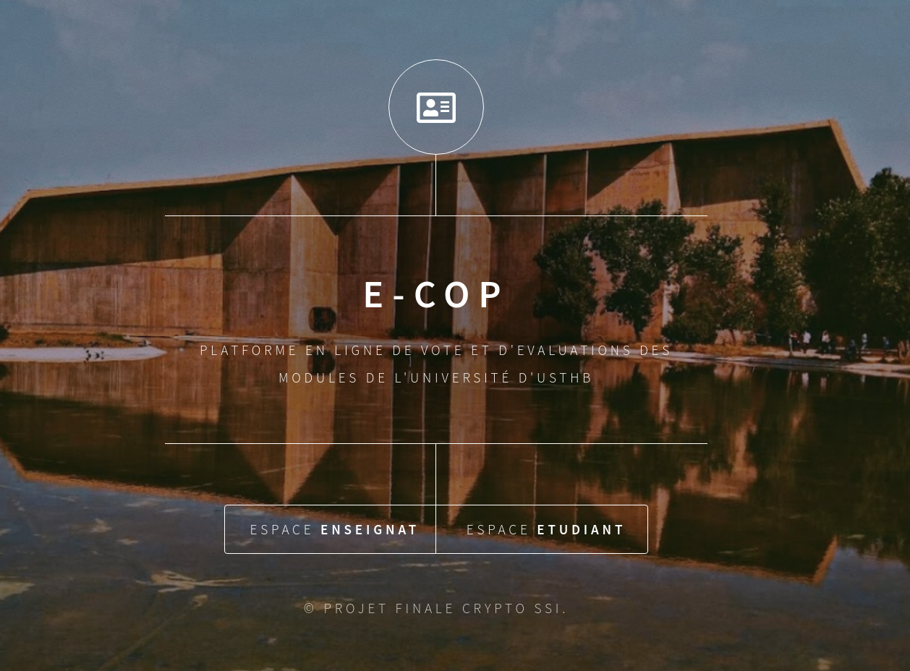
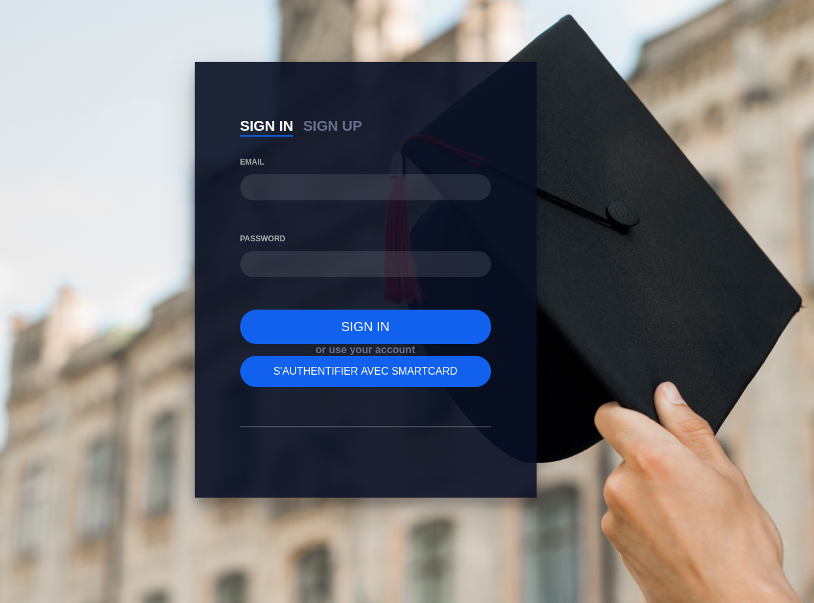
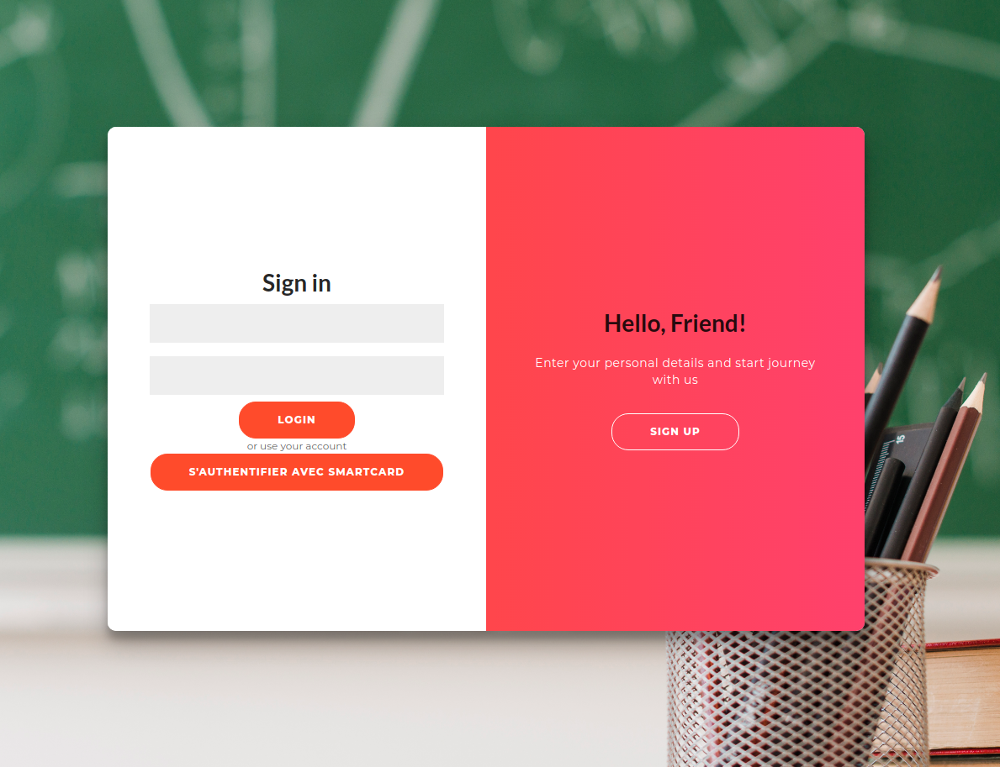

# E-campus-usthb

E-cop is an online CP (conseil pedagogique) for students and teachers, where they can login using
RFID cards to ensure security, privacy, and authenticity.

Teachers can create custom forms to ask courses-related questions, and
students can give their opinion anonymously, all results are encrypted using
modern cryptography algorithmes such as RSA and Shamir Secret Sharing.

| Home Page |
|:---:|
|   | 

|   | 
|:---:|:---:|
| Teacher Login | Student Login |

## Schéma global de fonctionnnement

